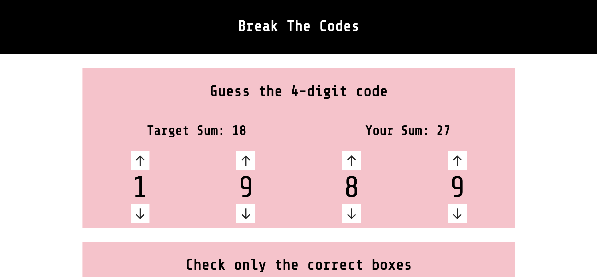

# CodeBreakers React Lab

## The Goal

We're going to create a puzzle game that represents a security system. In order to get past the system, a user will need to enter a series of correct code of various input types.

These components are half-built, but not fully-built. You're going to finish building as many of them as you can.

## The Setup

1. Make a copy of this template with either the "Use This Template" or "fork" button.
2. Clone this repository using `git clone`
3. `cd` into the project folder
4. `npm install`
5. `npm start`

## The Lab

The styling is mostly built out, so you probably won't need to work much on the CSS, but the components are still pretty rough. Each one has a list of features you'll want to build out.

### Part One: The secret word

##### Core features:

1. Modify the `onChange` function so that the value of the `guess` state variable is updated whenever the user changes the contents of the input field.
2. Rewrite the variable `winning` to be true if the guess and password match, and false in all other situations. Be sure to consider how you plan to handle capital or lowercase letters.
3. Use the already-built `countSimilarLetters` to set a more accurate value for `lettersCorrect` than is currently there.
4. Make sure that the current guess and letters correct are being displayed on the panel.

###### Stretch features:

- Refactor this component so that the answer or password can be passed in as a prop.
- Make any other necessary changes to support the refactoring.

### Part Two: The 4-digit NumberDials Lock

###### Core features:

1. Make the component's state's `numA` property display where it currently says `##A`.
2. The increase button works, but the decrease button doesn't. Build the decrease button's `onClick` function.
3. Right now there's only a `numberPlate` div for the `numberA` value. Build out sibling elements that are also number plates for the other three numbers.
4. Have "Your Sum" `<h3>` element display the sum of your current four digits.

###### Stretch features:

- Fix the number plates so that they can only ever show a single, non-negative digit, 0-9.
- Refactor the component so that the answer key can be passed in as a prop, instead of hard-coded into the component.
- Come up with a better hint mechanism. Right now there are still hundreds of combos that would total to any given sum. It's more like a password system than a puzzle, but a better hint (or set of hints) could make it more fun.

### Part Three: The Checkboxes Pattern Board

###### Core features:

0. BEFORE fixing this component, make sure you understand how the checkboxing works. The CSS is written so that if a div has both "checkbox" and "true" in it's class list, it will be styled with a check. Otherwise, it will be rendered without one.
1. The last two checkboxes have incomplete `className` attributes. Update them with the JSX necessary for them to reflect the component's state.
2. FIRST code out the `handleClickForBox()` function. If the clicked box is currently listed as false, change it to true. If it's currently true, change it to false.
3. Update the last two checkboxes to have and `onClick` attribute, like the first two do.
4. Code out the `countTrue` function to iterate over the `checks` and count up the number of `true` values. Return that number instead of the placeholder "##" that's there now.
5. Code out the `winning()` function to check and see if the `checks` array perfectly matches the `answerKey` array.

###### Stretch features:

- Add 12 more checkboxes, for a total of 16, and update the answer key and target sums to match.
- Right now the hint is hard coded. Generate the number dynamically, by examining the answer key.
- The hint is pretty opaque and not very helpful. Come up with a better system.
- Generate a random pattern.

### Part Four: The ColorCaptcha Slider Test

###### Core features:

1. Update the `onChange` function to call `setRed` with the new value instead of just console logging it.
1. Create `green` and `blue` state values that default to zero.
1. Add in the missing color `input` ranges for green and blue, and code out the corresponding events.
1. Update `yourColor` to be dynamically created from all three of the existing state values.
1. Build out the `winning` function to figure out whether `yourColor` perfectly matches the `answerColor`.

###### Stretch features:

- Right now, this puzzle is almost impossible. Make this third part more manageable by either making the `winning` function more flexible, or by making the clue a little more interesting.

## Extension

### BONUS Part Five: The Slider Puzzle

This last part was built, but never finished, and it isn't included in the `App.js` file yet. The actual sliding mechanic is already built out, but the answer key and some other features (including the `winning` function to see if the puzzle is finished correctly) still need to be built out.
